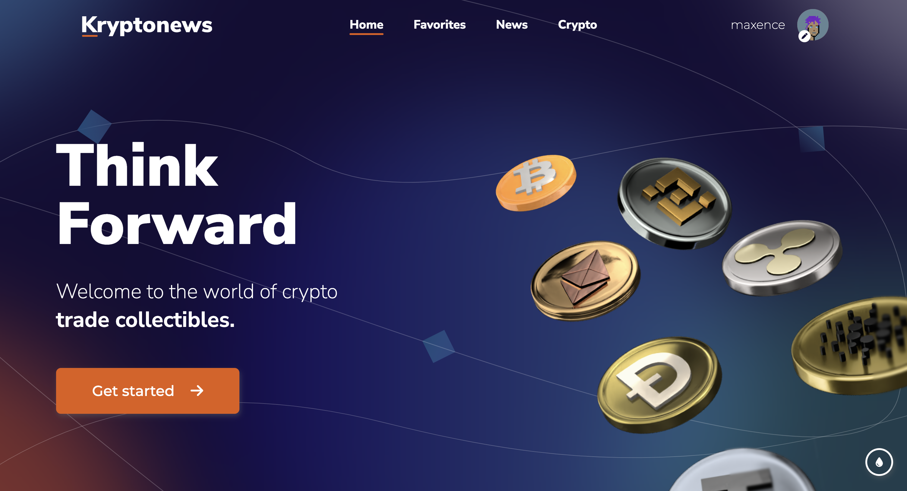
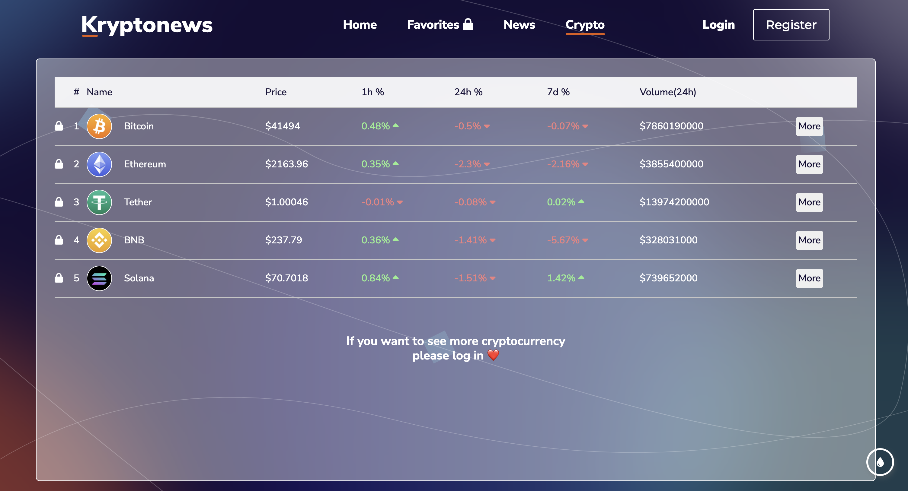
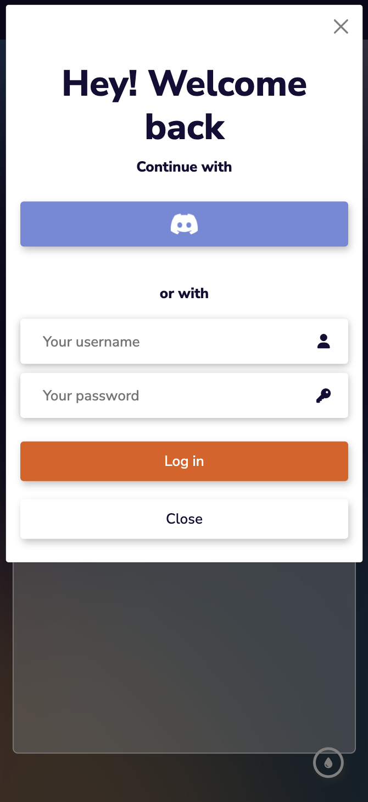

# Kryptonews 💰

Kryptonews is a project at the Epitech school within the framework of the MSC program. The aim of this project is to create a web application centered around cryptocurrencies. To achieve this, we are required to utilize free cryptocurrency APIs and RSS feeds from various media outlets discussing these digital currencies. All this data must be processed by our backend before being displayed on our frontend. Users can access the site as simple, unauthenticated users, but in this case, they won't have access to the various features of the site.

In this repository you have :  

**front folder** its our web interface made with ReactJs  
**back folder** its our backend made with NodeJs & ExpressJs 

# Some previews

  
Web - Desktop (click me) 💻

  
  
  
  
  
  
  

  
Web - Mobile (click me) ☎️

  
  
  

# Quick Start
<ins>Requirements</ins>  
- Docker Desktop

<ins>How to start ?</ins>

- Web application
  -  Go to the root of the project
  -  Do in a terminal : **docker compose up -d**
  - That's all !
 
# Techno and Tools

# TEAM
🔵 [Maxence BONNICI](https://github.com/ImMaxence)  
🔴 [Maxence LAPORTE]()  
🟢 [Matéo SALVY]()  
🟣 [Meriem BOUSSAID]()  
🟡 [Federico SUAREZ]()  
